# AI Study Assistant - System Architecture

This document provides a comprehensive overview of the AI Study Assistant's architecture, showing how the frontend, API layer, LangGraph AI orchestration, and databases interact.

```mermaid
flowchart TB
    %% Styling
    classDef frontend fill:#3b82f6,stroke:#1d4ed8,stroke-width:2px,color:#fff
    classDef api fill:#10b981,stroke:#047857,stroke-width:2px,color:#fff
    classDef ai fill:#8b5cf6,stroke:#6d28d9,stroke-width:2px,color:#fff
    classDef db fill:#f59e0b,stroke:#b45309,stroke-width:2px,color:#fff
    classDef node fill:#e11d48,stroke:#be123c,stroke-width:2px,color:#fff
    classDef ext fill:#64748b,stroke:#334155,stroke-width:2px,color:#fff

    %% Components
    Client["📱 Client App (HTML/CSS/JS)"]:::frontend

    subgraph "FastAPI Backend Layer"
        Router["🚪 Main Router (main.py)"]:::api
        AuthAPI["🔐 Auth API (/api/auth)"]:::api
        DocAPI["📄 Docs API (/api/documents)"]:::api
        ChatAPI["💬 Chat API (/api/chat)"]:::api
    end

    subgraph "Core Services"
        DocProc["⚙️ Document Processor"]:::api
        EmbedSvc["🧠 Embedding Service\n(MiniLM)"]:::api
        LLMSvc["🤖 LLM Service\n(Ollama Client)"]:::api
    end

    subgraph "LangGraph Workflow Analytics (graph.py)"
        State["Graph State & Context"]:::ai
        Intent["🎯 Intent Classifier Node"]:::node
        Retriever["🔍 Document Retriever Node"]:::node
        AnsGen["📝 Answer Generator Node"]:::node
        DoubtRes["💡 Doubt Resolver Node"]:::node
        AnsEval["✅ Answer Evaluator Node"]:::node
        QuesGen["❓ Question Generator Node"]:::node
    end

    subgraph "Data Storage"
        SQLite[("🗄️ SQLite DB\n(Users, History)")]:::db
        Chroma[("📊 ChromaDB\n(Vector Embeddings)")]:::db
        Disk[("📁 Local Disk\n(Uploads)")]:::db
    end

    Ollama["⚡ Ollama Engine\n(Mistral/Llama3)"]:::ext
    
    %% Flows - Client to API
    Client <-->|"REST API / SSE (Streaming)"| Router
    Router --> AuthAPI
    Router --> DocAPI
    Router --> ChatAPI

    %% Auth Flow
    AuthAPI <-->|"JWT / bcrypt"| SQLite

    %% Document Flow
    DocAPI -->|"Upload File"| DocProc
    DocProc -->|"Save File"| Disk
    DocProc -->|"Text Chunks"| EmbedSvc
    EmbedSvc -->|"Vectors"| Chroma
    DocAPI -->|"Metadata"| SQLite

    %% Chat & AI Flow
    ChatAPI -->|"History"| SQLite
    ChatAPI -->|"Query + History"| State
    State --> Intent
    
    %% LangGraph Routing
    Intent -->|"Extracts intent"| Retriever
    Retriever -->|"Fetches relevant chunks"| Chroma
    Retriever -->AnsGen & DoubtRes & AnsEval & QuesGen
    
    %% Graph to LLM
    Intent -.->|"Rule-based + LLM"| LLMSvc
    AnsGen -.->|"Prompt + Context"| LLMSvc
    DoubtRes -.->|"Prompt + Context"| LLMSvc
    AnsEval -.->|"Prompt + Context"| LLMSvc
    QuesGen -.->|"Prompt + Context"| LLMSvc
    
    %% LLM Engine Execution
    LLMSvc <-->|"HTTP Requests"| Ollama
    
    %% Response back to client
    AnsGen & DoubtRes & AnsEval & QuesGen -->|"Final Output"| ChatAPI
```

### Component Breakdown

#### 1. Frontend & API Layer
- **Client App**: A single-page application built with vanilla HTML, CSS, and JS. Communicates via REST APIs and handles Server-Sent Events (SSE) for token-by-token streaming.
- **FastAPI Endpoints**: Divided categorically into `auth` (JWT generation/validation), `documents` (uploading and processing files), and `chat` (managing conversations and triggering the LangGraph pipeline).

#### 2. LangGraph AI Orchestration
- **Intent Classifier**: Parses the user's query and conversation history to determine the objective (e.g., generate answer, evaluate answer, clarify doubt).
- **Document Retriever**: Queries ChromaDB for semantic chunks relevant to the user query, applying filtering based on document type (notes, marking schemes, question papers).
- **Specialized Nodes**: Depending on intent, execution routes to highly specialized agents (Answer Generator, Doubt Resolver, etc.) equipped with optimized system prompts.

#### 3. Core Services & Storage
- **Ollama Engine**: Runs locally to provide LLM inference without external API calls, ensuring high privacy and zero data leakage. 
- **ChromaDB**: The vector store where semantic embeddings (from `all-MiniLM-L6-v2`) of all document chunks are stored.
- **SQLite**: The relational database tracking users, authentication hashes, document metadata, and conversation histories.

---

### Step-by-Step Data Flow

#### 1. Document Upload & Processing Flow
When a user uploads a new study material (PDF, textbook, or notes):

1. **Upload Request (`/api/documents/upload`)**: The frontend sends the file and metadata (what document type it is: e.g., Notes, Marking Scheme) to the FastAPI backend.
2. **Document Processor**: 
   - Extracts plain text from the raw file (handling PDFs, Word Docs, text files, etc.).
   - Splits the massive text into smaller, overlapping "chunks" (usually ~500-1000 characters each) so the AI can digest it.
3. **Embedding Service**: Each text chunk is passed through a lightweight AI model (`all-MiniLM-L6-v2`) which converts the words into a dense mathematical vector (an array of numbers representing the semantic meaning of the text).
4. **Vector Storage**: These vectors, along with the original text chunk and document metadata, are saved into **ChromaDB**.
5. **Relational Storage**: The document's high-level info (filename, upload date, owner ID) is saved to **SQLite** so it shows up in the frontend dashboard.

#### 2. Query Execution Flow (The LangGraph Engine)
When a user types a question into the chat, the system orchestrates a complex workflow to generate the best possible answer:

1. **Chat Request (`/api/chat/stream`)**: The query and selected document IDs are sent to the backend.
2. **Graph Context Initialization**: A LangGraph `State` object is created. This acts as a shared context that holds the query, conversation history, and the final answer as it gets built.
3. **Node 1: Intent Classifier**: 
   - The first step of the AI graph. It analyzes the message to figure out *what* the user wants. 
   - *Example*: If the query is *"Grade my answer..."*, it routes to the Answer Evaluator. If the query is *"Explain osmosis"*, it routes to Doubt Resolution.
4. **Node 2: Document Retriever**:
   - The system takes the query and searches **ChromaDB**.
   - It performs a "semantic similarity search" to find the text chunks from uploaded documents that mathematically match the meaning of the question.
   - It retrieves these chunks and adds them to the shared `State`.
5. **Node 3: Specialized Generators**: Depending on the detected intent, one of the following specialized nodes takes over:
   - **Answer Generator**: Writes an exam-style answer using strict marking schemes.
   - **Doubt Resolver**: Acts as a tutor, explaining concepts based *only* on the retrieved notes.
   - **Answer Evaluator**: Compares a submitted answer against marking points and assigns a score + feedback.
   - **Question Generator**: Generates practice MCQs or long-form questions. 
   *(Each of these nodes sends a highly engineered, specific prompt + the retrieved context to the **Ollama LLM**).*
6. **Streaming Response**: As the local Ollama LLM generates the answer token-by-token, the FastAPI backend streams it immediately back to the browser UI using Server-Sent Events (SSE), creating a real-time typing effect.
7. **History Saving**: Once finished, the full cycle (query + AI response) is saved into the SQLite database so the AI remembers context for the next interaction.
